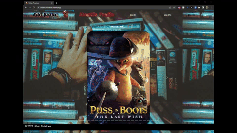
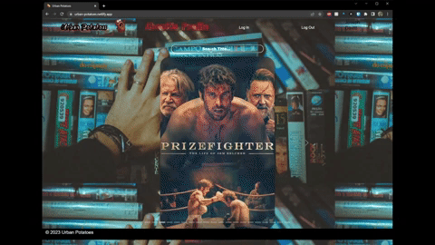

# Urban Potatoes

This is a [group project](https://github.com/UrbanPotatoes/UrbanPotatoesFrontend) I participated in at Code Fellows.

The application is deployed with netlify and can be found here: [Urban Potatoes](https://urban-potatoes.netlify.app/)

> **The server side is deployed with render, it is a free service and sometimes takes time to start the server when visiting the site.**

Some of my personal contributions include:

- Created the popular movies component.
- Created the search results component.
- Created the profile component.
- Created the selected movie component.
- Utilized state to display the user movie lists in the profile with data from the database.
- Participated in daily pair programming sessions.

Login with a Google account utilizing auth0 to enable viewing the profile page and user data storage.

Using the search box, you can find movies to add to your favorites and watch lists.

## Authors

Joe Davitt, Marlon Angulo Jr, Yen Xiong Yuan, Dutch Foy, and Diontre Sanders

## Wireframe

## Domain Model

